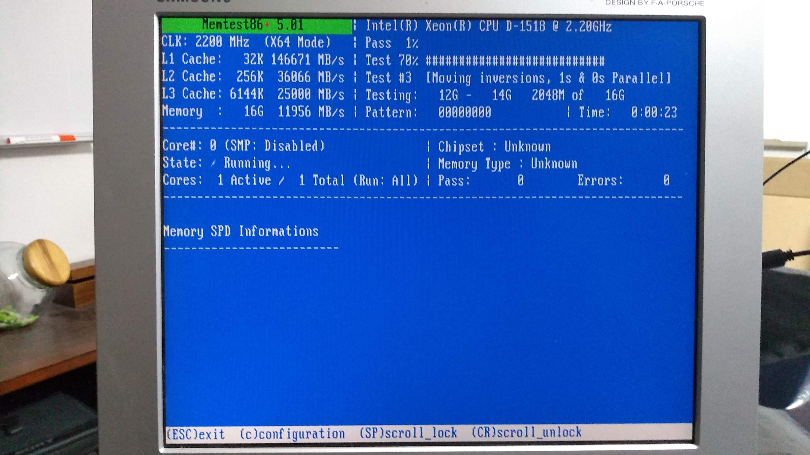

Ubuntu Server
=============

We use Ubuntu Server 18.04 LTS which is supported until 2023. We download it the
normal way from https://www.ubuntu.com/download/server . We check to make sure
that the file is intact by running

.. code:: bash 

        echo "ea6ccb5b57813908c006f42f7ac8eaa4fc603883a2d07876cf9ed74610ba2f53 *ubuntu-18.04.2-live-server-amd64.iso" | sha256sum --check

which gives you an OK. Move to USB stick with `Startup Disk Creator`.

Memory Test
-----------

Before we can proceed, we use the Ubuntu USB stick's memory test function to
make sure that our RAM is okay.

This can take hours.

Basic installation
------------------

After the memory test, reboot and start installing the server.

.. warning:: During the install, do not select the option to install Docker.
        This will install Docker into a snap, which will then not work correctly. 
        In fact, you probably want to avoid all snaps.

Afterwards, we update the system and reboot to be sure:

.. code:: bash

        sudo apt update
        sudo apt upgrade
        sudo reboot

The name of the user we install as will be ``user1`` in our examples.

.. note:: Most of the examples here have ``sudo`` in front of them to mark that
        they have to be executed by the superuser. If you tire of this (and you
        will), use 
        
        .. code:: bash

                sudo su -
        
        to switch to root permanently. Remember to ``exit`` as soon as possible.

